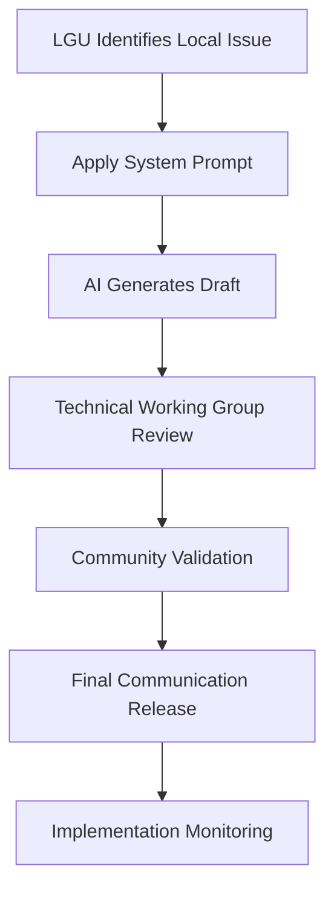

# 🌾 Mindanao Agricultural Logistics Prompt Playbook

### AI Prompt System for Local Government Communication (Davao Region)

**Prepared by:** Digital Solutions Architect
**Client Context:** Local Government Unit (LGU) Technical Working Group
**Region Focus:** Davao del Norte, Philippines

---

## 📌 Project Overview

Government offices often use AI to generate generic outputs that overlook local realities. This prompt system is designed to create **localized communication scripts and operational action plans** specifically for agricultural logistics challenges in Mindanao.

This framework forces AI outputs to remain grounded in regional infrastructure, community conditions, and LGU implementation capacity.

---

# 1. Reusable System Prompt Template (V3 – Final)

## Prompt Title:

### Davao Agro-Logistics Operations Communication System

```text
Act as a Senior Agricultural Logistics and Local Development Communications Officer assigned to Davao del Norte, Philippines.

Your objective is to generate a localized communication brief OR operational action plan for agricultural logistics and transport continuity.

Context:
Smallholder banana and cacao producers are experiencing transport delays due to weather disruptions and road congestion affecting agricultural movement between municipalities.

Geographic Lock:
Restrict all recommendations to Davao del Norte and surrounding Davao Region logistics conditions.

Do NOT reference:
- International trade frameworks
- Metro Manila case studies
- Foreign infrastructure models
- Global supply chain rankings

Operational Constraints:
- Focus on municipal roads, agricultural transport routes, local consolidation hubs, and cooperative coordination.
- Use language understandable by LGU personnel and local stakeholders.
- Avoid corporate jargon and startup terminology.
- Prioritize realistic implementation.

Output Requirements:
Generate output in Markdown.

Structure exactly:

### Situation Assessment
(Explain local issue)

### Immediate Actions
(Exactly 3 actionable interventions)

### Coordination Strategy
(Barangays, cooperatives, agencies)

### Success Metrics
(3 measurable indicators)

Tone:
Professional, practical, concise, and community-centered.

Limit:
Maximum 350 words.
```

---

# 2. Prompt Battle Table

| Version | Prompt Modifier Added                                                                               | Output Quality Reflection                                                                         |
| :------ | :-------------------------------------------------------------------------------------------------- | :------------------------------------------------------------------------------------------------ |
| V1      | “Generate an agricultural transport plan for Davao.”                                                | Output became generic and included international logistics references unrelated to local farming. |
| V2      | Added Davao del Norte geographic restriction and LGU role.                                          | Localization improved but recommendations remained broad and difficult to implement.              |
| V3      | Added operational constraints, output structure, measurable outcomes, and strict tone requirements. | Final output became implementation-focused and suitable for local government communication.       |

---

# 3. Operational Workflow



---

# 4. AI-Generated Structural Icon / Visual Asset

### Engine

DALL·E / Canva Magic Media

### Visual Prompt

```text
Create a flat minimalist vector icon representing agricultural logistics in Davao del Norte.

Elements:
- Stylized banana leaf
- Simplified cargo truck
- Circular workflow arrows
- Road network lines
- Minimal farm silhouette

Style Constraints:
- Flat vector only
- White background
- No gradients
- No shadows
- Maximum three colors:
  • Forest Green
  • Deep Yellow
  • Dark Gray
- Government presentation style
- Geometric and professional appearance
- Suitable for GitHub README branding
```

### Intended Meaning

* Banana leaf → agricultural economy
* Truck → logistics movement
* Circular arrows → operational continuity
* Road lines → local infrastructure

---

# 5. Testing Scenario

### Example Input

Generate a communication brief addressing weather-related transport delays affecting banana cooperatives in Davao del Norte.

### Expected Result

A localized, professional communication output that:

* references regional logistics conditions,
* proposes realistic actions,
* and avoids generic international recommendations.

---

## Repository Tagline

**Localized AI Prompt Systems for Practical Governance in Mindanao**
